# UI Museum
Screenshots of user interface elements from various operating systems.

## Buttons

### mac-1

### mac-9 (Platinum)

### mac-100 (Aqua)

### mac-100 (Graphite)

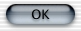
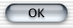
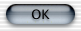

### mac-1015 (Aqua)

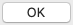

### mac-1015 (Dark)

### mac-1015 (Graphite)

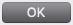
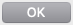

### mac-1015 (Graphite Dark)

### windows-1

### windows-31

### windows-7 (Aero)

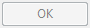

### windows-95

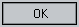

### windows-2000

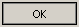

### windows-xp (Blue)

### windows-xp (Olive)

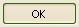

### windows-xp (Silver)

### windows-10

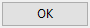
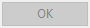
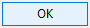
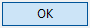
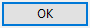

### Details

The images are named according to this pattern:

    OS-version-theme-element-state.png 
    
Each contains a ~2 pixel border surrounding the element, showing what the element looks like in a standard dialog box of the operating system.
